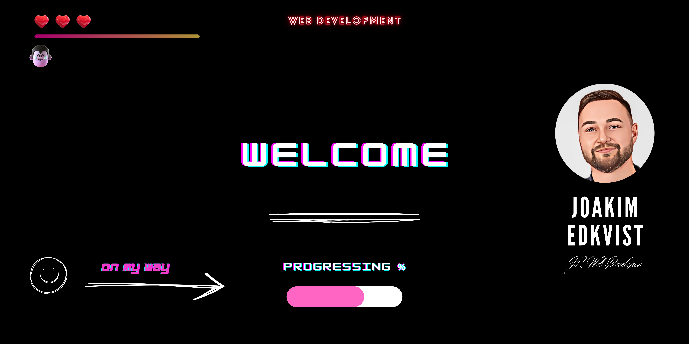

## Hi! My name is Joakim! 👋
### I'm a Web Developer Student at IT-Högskolan in Gothenburg. <i>(2021 - 2023)</i> 🌱

### Dev Career & Projects summary :computer:
Just finished first year of the Front-End Developer program with multiple projects & courses.
- If you want to have a look at my previous projects, visit my portfolio [here](https://joakimedkvist.github.io/) :sunny:
- Exciting internship coming up this winter :zap:

### Employeer's
- Don't hesitate to connect with me on    for further questions.

### Contact Details
- Mobile: +46 728818375 :phone:
- Mail: joakimedqvist@hotmail.se or press here this button  

<!--
**JoakimEdkvist/JoakimEdkvist** is a ✨ _special_ ✨ repository because its `README.md` (this file) appears on your GitHub profile.

Here are some ideas to get you started:

- 🔭 I’m currently working on ...
- 🌱 I’m currently learning ...
- 👯 I’m looking to collaborate on ...
- 🤔 I’m looking for help with ...
- 💬 Ask me about ...
- 📫 How to reach me: ...
- 😄 Pronouns: ...
- ⚡ Fun fact: ...
-->
